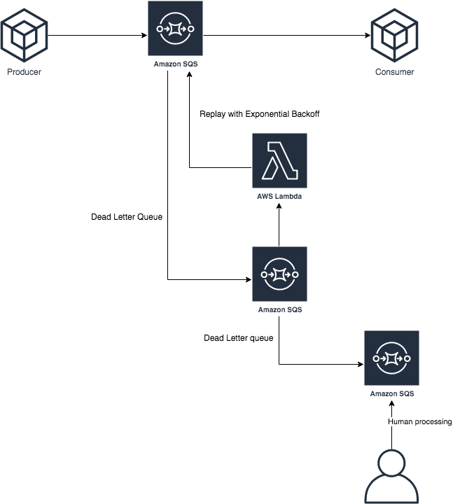

# SQS dead letter retry

This serverless app deploy a SQS queue, packaged with a dead letter queue (DLQ). A lambda function retries each message of the DLQ with an exponential backoff and jitter. After some unseccessful retries, messages are moved to a second DLQ

## App Architecture

## Installation Instructions

1. [Create an AWS account](https://portal.aws.amazon.com/gp/aws/developer/registration/index.html) if you do not already have one and login
1. Go to the app's page on the [sqs-dlq-retry Serverless Application Repository page](TODO) and click "Deploy"
1. Provide the required app parameters (see parameter details below) and click "Deploy"

## App Parameters

1. `LogLevel` (optional) - Log level for Lambda function logging, e.g., ERROR, INFO, DEBUG, etc. Default: INFO
1. ...

## App Outputs

1. `RetryFunction` - My Lambda function name, which replays SQS messages.
1. `MainQeueArn` - Main SQS queue.
1. `RetryDeadLetterQeue` - Internal SQS dead letter queue.
1. `DeadLetterQeue`- SQS dead letter queue

## License Summary

This code is made available under the TODO license. See the LICENSE file.
